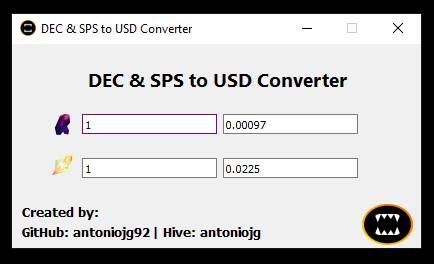

## DEC & SPS TO USD CONVERTER

It's a program to convert the value of the DEC & SPS token to USD and vice versa, using the conversion price or rate provided by the Splinterlands API.

# Instructions for Windows
- Download the 64 Bit version of [name.zip]()
- Download the 32 Bit version of [DEC-&-SPS-2-USD.zip](https://github.com/AntonioJG92/Conversor-DEC-SPS-2-USD-APIS/raw/main/DEC-&-SPS-2-USD-32BIT.zip)
- Unzip the file NAME.zip wherever you want.
- Run the exe file.

# Source code
You can download the Python scripts and modify them as you wish. You can also use the program on operating systems such as Linux or Mac if you install the necessary dependencies.

# Made with ❤️
Program developed with Python, the PyQt5 library and Pyinstaller using AutoPyToExe.

# Support the project
If you like the program you can support its development.

  

  
